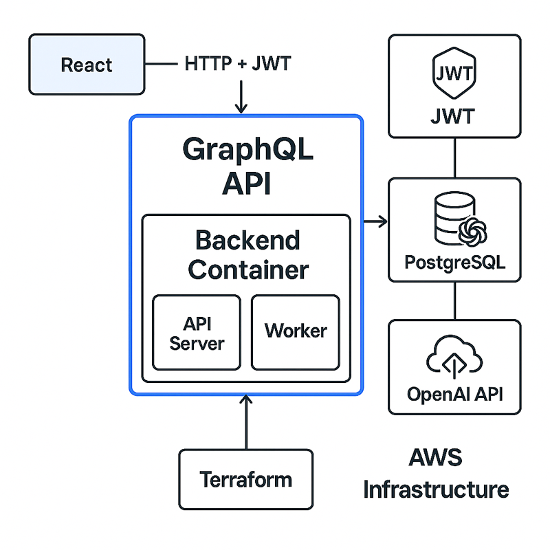

# 🧠 AI Ops Assistant

AI Ops Assistant is a full-stack project simulating a lightweight AI-powered operational triage system. It allows ingestion of raw logs and tickets, summarizes and classifies them, and exposes the results via a GraphQL API.

## 📐 System Design

See the [System Design One-Pager](./docs/AI_Ops_Assistant_System_Design.md) for an architecture breakdown.



## 📆 Project Roadmap

See the [MVP Roadmap](./docs/ai_ops.mvp_roadmap.md) for implementation phases and deliverables.

## 🧪 Local Development

```bash
docker-compose up --build
```

Test the GraphQL API at:
```
http://localhost:8080/graphql
```

## 🔧 Tech Stack

- Go 1.23
- GORM (Postgres)
- GraphQL (graphql-go)
- OpenAI API (for summarization)
- JWT authentication
- Docker + Docker Compose
- Terraform (for AWS RDS provisioning)

## ✅ Features

- Summarize logs using OpenAI
- Classify tickets with pluggable logic
- View logs, tickets, and changelogs via GraphQL
- Cleanly separated API and worker services
- Structured project layout for production readiness

---

MIT License.
