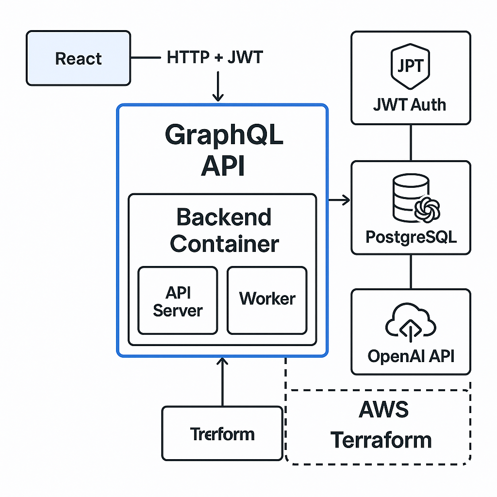

# AI Ops Assistant

AI Ops Assistant is a backend platform inspired by Roblox’s mission to scale internal operations with intelligent, efficient tooling. It simulates the kinds of productivity systems that support cross-functional teams like Engineering, People, and Finance — helping organizations operate at 10x efficiency through automation and AI.

Built with Go, GraphQL, and OpenAI, the system handles log summarization, ticket triage, and changelog generation using a secure API and background workers. It mirrors real-world use cases in platform engineering, developer enablement, and internal tooling — key focuses of Roblox's Productivity Platforms and Ecosystems team.

---

## 🧰 Tech Stack

- **Language:** Go (1.21)
- **API Layer:** [graphql-go](https://github.com/graphql-go/graphql)
- **Database:** PostgreSQL (via GORM)
- **Auth:** JWT (login, signup, me)
- **Async Processing:** Background worker services (Go)
- **Containerization:** Docker + Docker Compose
- **Infrastructure:** Terraform (planned)
- **Frontend (planned):** React

---

## 🔍 Roblox-Relevant Features

- **🧠 Intelligent Automation:** Uses AI (OpenAI) to summarize logs and triage support tickets — simulating internal operational workflows  
- **🔒 Secure Internal APIs:** JWT authentication and admin-protected routes suitable for HR, Finance, and Engineering dashboards  
- **🔁 Asynchronous Processing:** Background workers handle summarization and classification tasks to simulate scalable productivity tooling  
- **📈 Designed for Scale:** Ready for CI/CD, cloud deployment, and extensibility for observability and metrics — reflecting real platform engineering concerns

---

## 🗺️ Architecture Diagram



# AI Ops Assistant

AI Ops Assistant is a backend system designed to simulate intelligent operations (ITOps) workflows like log summarization, ticket triage, and changelog generation. It provides a GraphQL API for internal dashboards and automation tools, and supports background processing via worker services.

---

## 🧰 Tech Stack

- **Language:** Go (1.21)
- **API Layer:** [graphql-go](https://github.com/graphql-go/graphql)
- **Database:** PostgreSQL (via GORM)
- **Auth:** JWT (login, signup, me)
- **Async Processing:** Background worker services (Go)
- **Containerization:** Docker + Docker Compose
- **Infrastructure:** Terraform (planned)
- **Frontend (planned):** React

---

## ✅ MVP Overview

The MVP includes four core features:

1. **Log Summarization**
   - Accept raw log data
   - Generate a summary (mocked NLP)
   - Store and retrieve via GraphQL
   - Async summarizer worker included

2. **Ticket Triage**
   - Accept and classify tickets
   - Store in DB
   - Async triage worker included
   - Filter by status

3. **Changelog Generation**
   - Accept commit-like entries
   - Generate structured changelogs
   - Store grouped output as JSON
   - Query by ID or list

4. **Secure Admin API**
   - JWT login and signup
   - Passwords hashed with bcrypt
   - Protected queries and mutations
   - `me` query returns user info

---

## 📦 Project Structure

```
cmd/
  api/         # GraphQL server
  worker/
    summarizer/
    triage/

internal/
  auth/        # JWT helpers
  db/          # DB connection + init
  models/      # GORM models
  schema/      # GraphQL types & resolvers
  summarizer/  # Summarization logic
  triage/      # Ticket classification logic

.env
Dockerfile
docker-compose.yml
```

---

## 🚀 Current Progress

### ✅ Completed
- Full GraphQL API (modular schema)
- Log summarization and ticket triage (API + background workers)
- Changelog generation logic + query support
- JWT login/signup + bcrypt + `me` query
- All MVP features complete

### 🛠 Planned Next
- CI/CD via GitHub Actions
- Terraform-based AWS deployment
- React dashboard
- Metrics/observability layer

---

## 🧪 Example Query

```graphql
mutation {
  summarizeLog(raw: "Server crashed at 2am with out-of-memory error.") {
    id
    summary
  }
}
```

---

## 📄 License

MIT (c) 2025