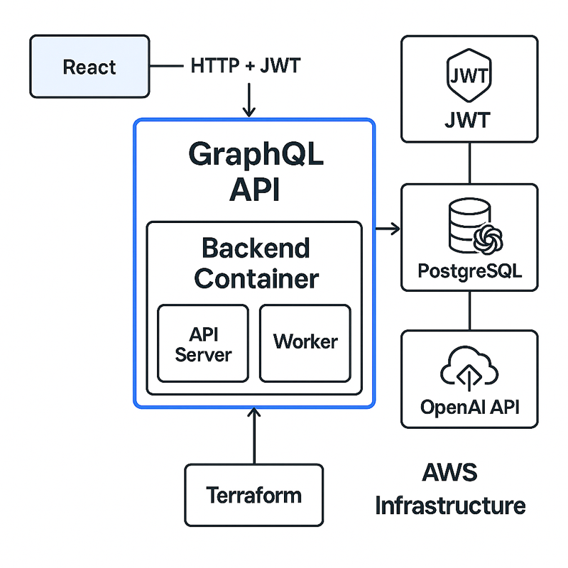

# AI Ops Assistant: System Design One-Pager

---

## Overview

**AI Ops Assistant** is a backend platform simulating internal productivity workflows such as log summarization, ticket triage, and changelog generation. Designed for engineering, HR, and operations teams, it integrates AI-powered automation and scalable backend architecture to increase internal efficiency.

---

## Core Use Cases

| Function             | User          | Outcome                                   |
|----------------------|---------------|-------------------------------------------|
| Log Summarization    | Engineering   | AI-generated summaries of raw system logs  |
| Ticket Triage        | Ops / Support | Auto-categorized tickets for faster routing |
| Changelog Generation | HR / PM       | Structured summaries of system changes     |

---

## Architecture Summary

- **Frontend (planned):** React dashboard for internal users  
- **API:** GraphQL server (Go) with modular schema  
- **Auth:** JWT-based authentication with bcrypt password hashing  
- **Database:** PostgreSQL with GORM ORM  
- **Async Workers:** Background services for log summarization and ticket triage  
- **AI Integration:** OpenAI API for summarization and classification  
- **Infrastructure:** Docker + Docker Compose (Terraform & AWS planned)  
- **Observability:** Prometheus (metrics), Grafana (dashboards), Alertmanager (alerts)  

---

## Design Principles

- **Security-first:** JWT auth, hashed credentials  
- **Async-first:** Worker pattern ensures non-blocking task execution  
- **Extensible:** Modular components (logs, tickets, changelogs) allow future expansion  
- **Observable:** Metrics exported from API & workers, collected by Prometheus, visualized in Grafana dashboards, and alerted via Alertmanager  
- **Dev-friendly:** Clean code structure, Docker-based development, CI/CD-ready  

---

## Sample Flow (Log Summarization)

1. User sends raw log data via GraphQL mutation  
2. API validates request and stores raw log in PostgreSQL  
3. Background worker processes the log, calls OpenAI for summarization  
4. Metrics (job started, succeeded, failed, duration) are exported at `/metrics`  
5. Prometheus scrapes metrics, Grafana displays API/worker throughput, latency, and error rates  
6. Result is stored and available via `logSummary` query  
